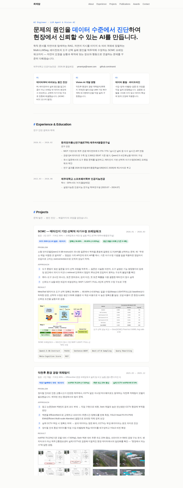

# 최예람 — AI Engineer Portfolio

> **🌐 포트폴리오 사이트 바로가기 → [eramii.github.io/choiyeram.github.io](https://eramii.github.io/choiyeram.github.io/)**

문제의 원인을 데이터 수준에서 진단하여, 현장에서 신뢰할 수 있는 AI를 만드는 것을 목표로 합니다.

제주대학교 소프트웨어학부 인공지능전공 (2026.08 졸업예정) · GPA 4.01/4.5
📧 yeramiya@naver.com

## 주요 프로젝트

| 프로젝트 | 핵심 성과 |
|---|---|
| **SCMC** — 메타인지 기반 선택적 자기수정 프레임워크 | KCC 2026 포스터 발표(제1저자) · 도구 선택 정확도 +3.92%p, 평균 호출 2.53회 |
| **악천후 환경 경량 객체탐지** | 적정기술학회지 게재(제1저자) · mAP50 +7.83%p, 추론 속도 23% 향상 |
| **Multi-LLMSeg** — 멀티모달 LMM 세그멘테이션 | 단일 객체 → 자연어 지시 기반 다중 객체 동시 분할로 구조 확장 |

## 미리보기

